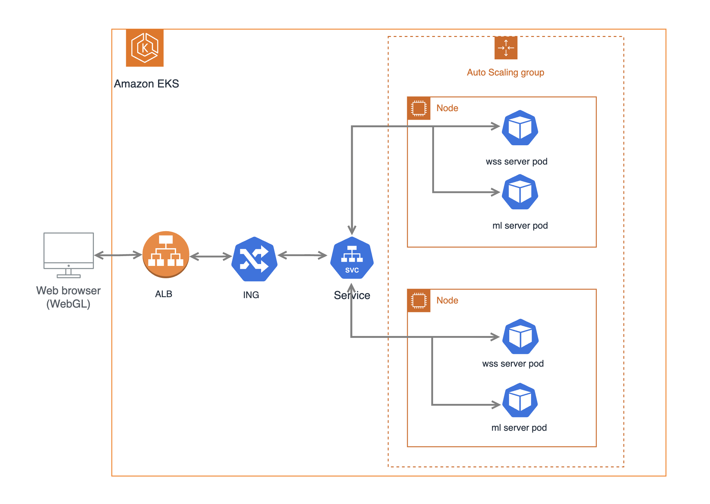
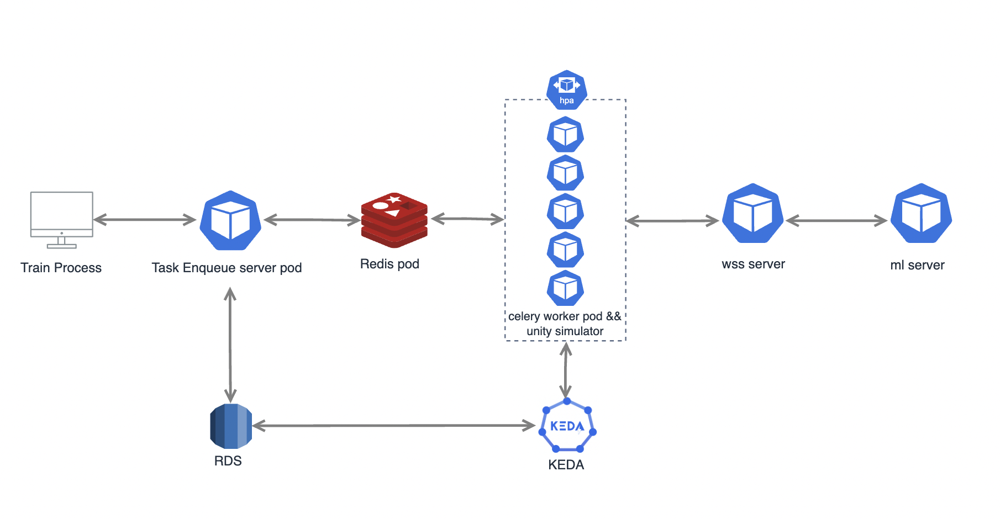

# Tower-Defense Game Project

이 레포지토리는 타워 디펜스 게임의 서버, 머신러닝 서버 그리고 시뮬레이터 아키텍쳐를 담고 있습니다. 시뮬레이팅을 통해 여러 타워 디펜스 시나리오를 테스트하여 머신러닝 모델을 업데이트 하였고, 실시간으로 ai agent와 경쟁할수 있는 게임입니다.

## Features

### Game
https://tower-defense-ai.chaneeh-games.com 

unity를 이용하여 타워디펜스 웹 게임을 구현하였습니다
### Server
웹 게임에서 메인 서버와 wss 프로토콜로 통신하였고, agent 행동에 관련한 추론은 fastapi로 구성된 ml server pod에서 담당하였습니다. 
학습된 ml model들은 s3를 모델 저장소로 사용하였고, ml model 관련 util 함수들은 test 코드를 이용하여 가독성 및 안전성을 높였습니다.

### Simulator

학습 및 simulate 구조도는 다음과 같습니다.

agent action을 모델링 하기 위해 q table 을 사용하였고, 모든 에피소드(5 tower wave)가 끝난뒤 보상을 계산하여 업데이트를 하였습니다.

train process에서 데이터 수집을 위해 simulator eneque 서버에 add task 요청을 하면, redis에 task enque가 되고, 요청된 simulator 횟수만큼
(`redis queue length` + `active celery worker`) unity simulater code가 포함된 celery worker 갯수가 scaling 됩니다. 
이후 각 celery worker image에 포함되어 있는 unity build code를 headless 모드로 실행시켜 환경, action, reward data를 수집하였습니다.

한 simulator당 1.7 core를 6분 정도 사용하였고, 학습 과정 각 스텝에서 평균 80개의 시뮬레이터 pod를 병렬로 생성하였습니다.

