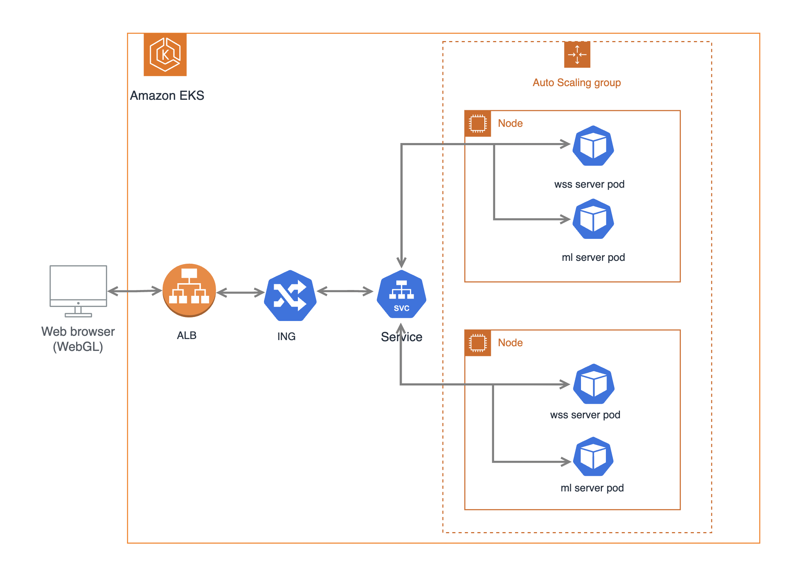
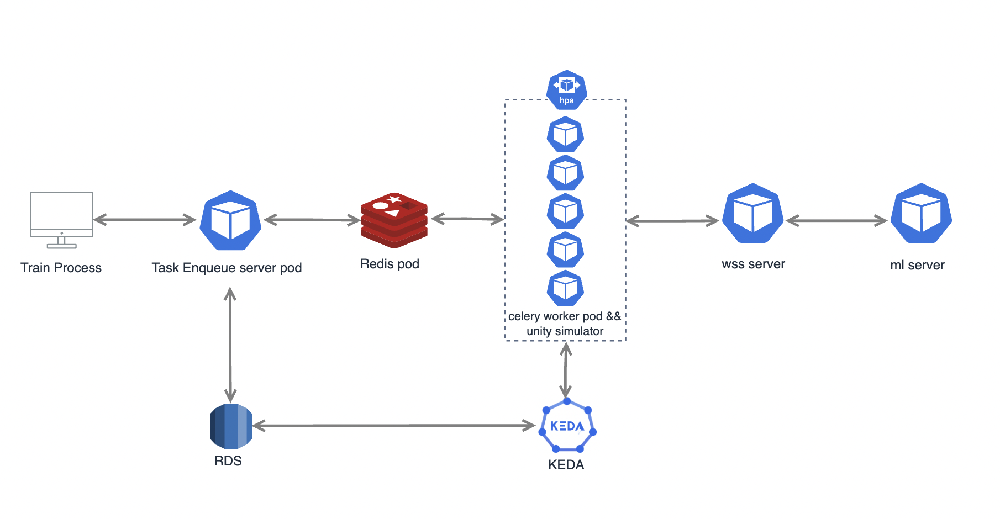

# Tower-Defense Game Project

이 레포지토리는 **타워 디펜스 게임**의 서버, 머신러닝 서버, 그리고 시뮬레이터 아키텍처를 포함하고 있습니다. 이 프로젝트의 목표는 **시뮬레이션을 통해 다양한 타워 디펜스 시나리오를 테스트**하고, 이를 바탕으로 **머신러닝 모델을 실시간으로 업데이트**하여 플레이어가 **AI agent와 경쟁할 수 있는** 게임 환경을 제공하는 것입니다.

## Features

### Game
https://tower-defense-ai.chaneeh-games.com 

- **Unity**를 사용하여 타워 디펜스 웹 게임을 개발하였습니다. 플레이어는 게임에서 AI와 실시간으로 경쟁할 수 있습니다.
### Server
- 게임 클라이언트는 **메인 서버**와 **WSS(WebSocket Secure) 프로토콜**을 통해 통신합니다.
- AI agent의 행동에 대한 **추론**은 **FastAPI**로 구성된 머신러닝 서버에서 처리되며, 각 **ML 모델**은 **S3**에 저장됩니다.
- 머신러닝 관련 **유틸리티 함수**들은 **테스트 코드**로 관리되어 코드의 가독성과 안전성을 높였습니다.

### Simulator

**Agent action**을 모델링하기 위해 `Q Table`을 사용하였고, **모든 에피소드**(5 tower wave)가 끝난 뒤 보상을 계산하여 업데이트를 하였습니다. 각 에피소드가 완료되면, **agent의 action에 대한 reward**는 최종 **wave score**에서 추출됩니다. 보상은 **agent가 wave를 얼마나 빨리 깼는지**에 기반하여 계산되며, 이를 통해 **Monte Carlo 방식**으로 에피소드 전체를 평가합니다.

#### Q-Table Update Process

- **보상 계산**: 에피소드가 완료된 후, 최종 **wave score**를 기반으로 각 행동에 대한 보상이 계산됩니다. 빠르게 클리어한 **wave**일수록 높은 보상을 받습니다.
- **Monte Carlo 방식**: 보상은 **에피소드가 끝난 뒤에 한 번에 계산**되며, 모든 행동에 대한 보상이 에피소드 종료 후 업데이트됩니다.
- **보상 근사**: 계산된 보상은 여러 **train step**에 걸쳐 조금씩 근사하여 Q-Table에 반영됩니다. 일반적인 `Q-Table`은 **보상 자체를 한 번에 업데이트**하지만, 이 게임 환경은 **확률적으로** 움직이고 이 게임 환경에서 모든 경우의 수를 탐색하는 것은 범위가 너무 넓기 때문에, **확률적 탐색**을 기반으로 Q-Table을 업데이트하도록 하였습니다.

#### Train Process

데이터 수집 과정은 다음과 같이 이루어집니다:

1. `Simulator Enqueue` 서버에 **add task 요청**을 하면, **Redis**에 task가 enqueue됩니다.
2. 💡 **요청된 simulator 횟수**만큼 (`Redis queue length` + `Active Celery worker`) **Unity simulator code**가 포함된 `Celery worker`가 **자동으로 스케일링**됩니다. 이 방식으로 **높은 확장성**을 추가하였습니다.
3. 각 `Celery worker image`에 포함된 **Unity build code**는 **headless 모드**로 실행되어, 환경, action, reward 데이터를 수집합니다.

#### 성능 및 리소스 사용

- **각 simulator당** 평균 **1.7 core**를 사용하며, **6분**이 소요됩니다.
- **학습 과정 각 스텝에서** 평균적으로 **80개의 simulator pod**를 병렬로 생성합니다.
- **keda scaling**을 통해, 단일 시뮬레이션 클러스터에서 **수백 개의 에피소드**를 동시에 처리할 수 있습니다.

